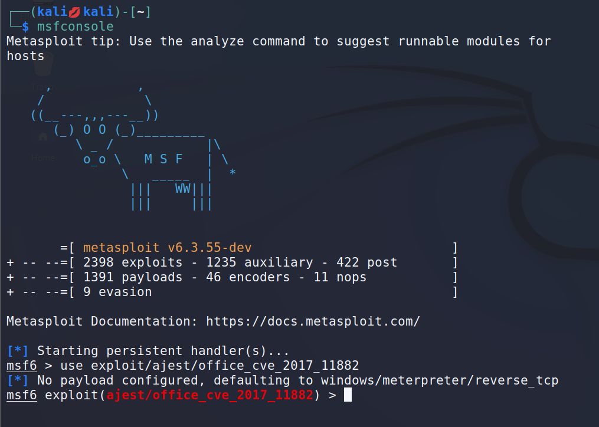
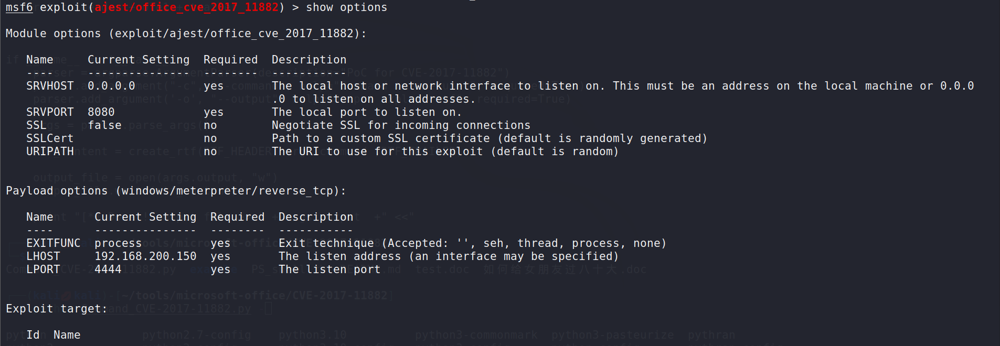
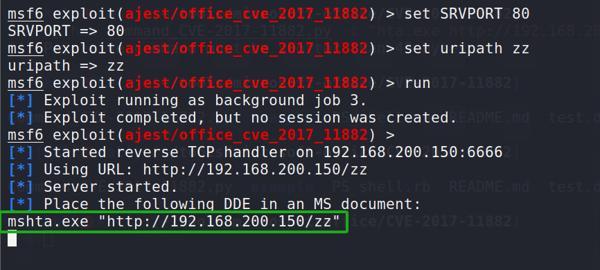
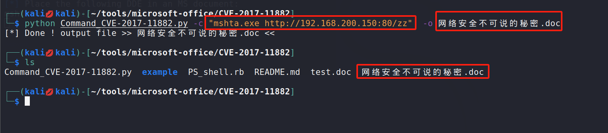
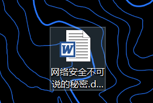
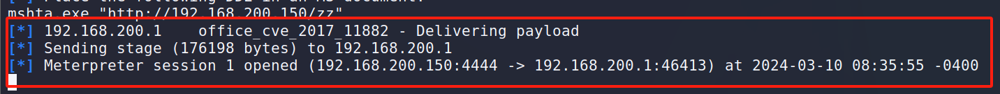
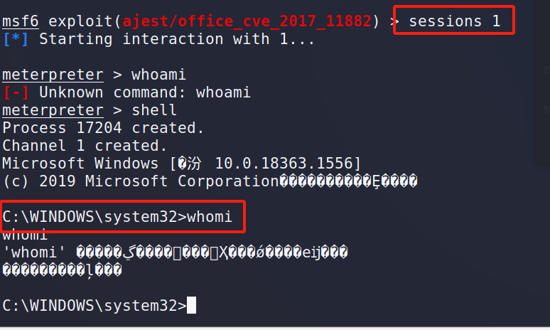

# 【漏洞复现】office_2017-2016   CVE-2017-11882

- 该漏洞是office一个组件EQNEDT32.EXE引起的栈溢出，通杀office2007-2016

### 复现过程

- 打开msf进入到cve-2017-11882模块

  

- 查看该模块的使用方法，就是当用户点击被注入恶意代码的文档文件后，会到`192.168.200.150/hecker`去下载一个木马并交给`mshta.exe`执行，然后受害者就在攻击者后台上线了。

  

- 设置参数，run后在绿色框中显示的就是需要在office文件中注入的代码

  

- 然后拿到该漏洞的exp

- 使用该脚本制造一个包含木马的doc文件，在`-c`参数后面写入之前生成的绿色框中的代码，-o参数后面跟需要生成的文件名字

  

  

- 然后把该文件传给受害者即可等他上线即可

  

  

- 点击后，受害者显示空白文件，但是kali后台则已经上线

- 拿到shell

